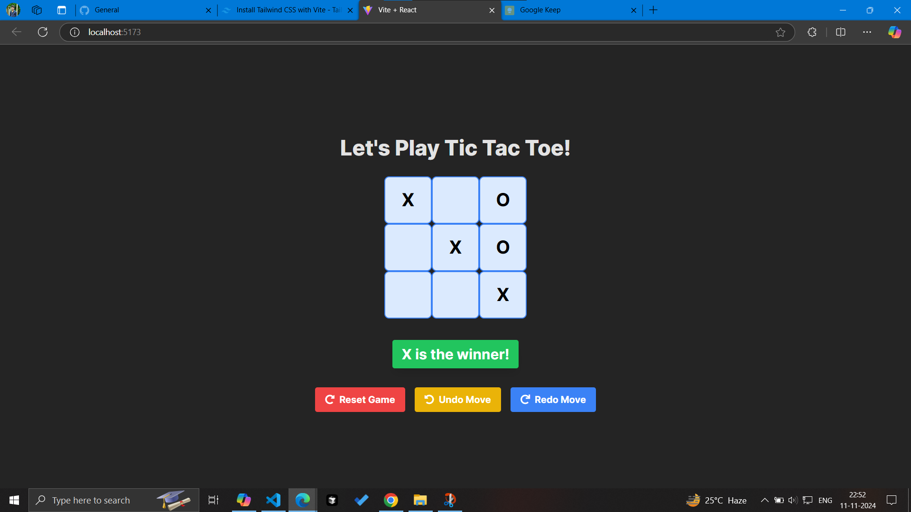
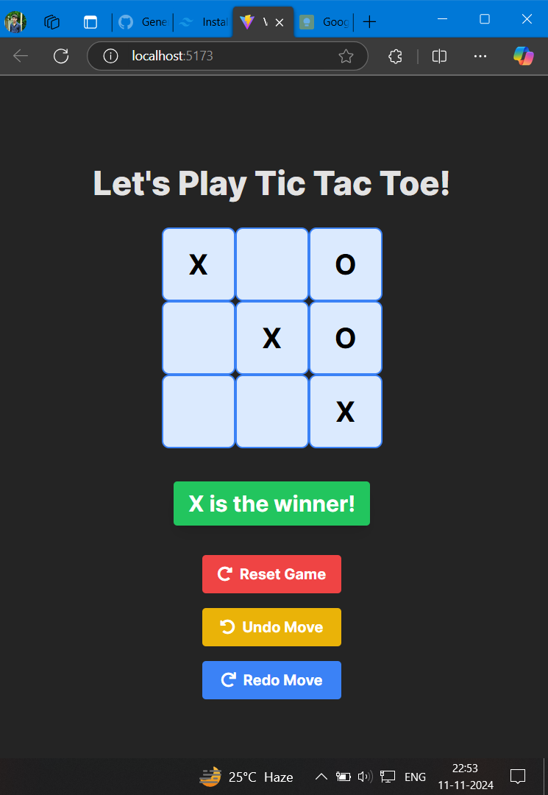

# Tic Tac Toe Game 🎮

## Overview
Welcome to the Tic Tac Toe game! This project is a simple implementation of the classic Tic Tac Toe game using React and Tailwind CSS. It includes features like resetting the game, undoing moves, and redoing moves. Enjoy playing against a friend in this fun and interactive game!

## Features
- 🔄 **Reset Game**: Start a new game at any time.
- ↩️ **Undo Move**: Go back to the previous move.
- 🔁 **Redo Move**: Redo the move that was undone.
- 📱 **Responsive Design**: The game is fully responsive and works well on all screen sizes.

## Screenshots 📸

<div align="center">  </div> <div align="center">  </div>

## Installation 💻
Follow these steps to get the project up and running on your local machine:

1. **Clone the repository** 🌀
   ```bash
   git clone https://github.com/your-username/tic-tac-toe.git
   ```

2. **Navigate to the project directory** 📂

    ```bash
    cd tic-tac-toe
    ```

3. **Install dependencies** 📦
    ```bash
    npm install
    ```

4. **Start the development server** 🚀
    
    ```bash
    npm start
    ```

## Usage 🕹️
Once the development server is running, you can open your browser and navigate to ```http://localhost:3000``` to see the Tic Tac Toe game in action.

## Technologies Used 🛠️
- React: A JavaScript library for building user interfaces.

- Tailwind CSS: A utility-first CSS framework for rapidly building custom designs.

- Font Awesome: A popular icon library used for adding icons to the buttons.

## Acknowledgements 🙏

- Inspired by the YouTube video tutorial by <a href="https://www.linkedin.com/in/yoshita-jain-510893148/">Yoshita Jain</a> Choudhary. Check out the tutorial <a href="https://youtu.be/D_tyfqNZm6I?si=FI1J_Y_cExXa73JR">here</a>.


## Contributing 🤝
If you'd like to contribute to this project, please follow these steps:

1. Fork the repository.

2. Create a new branch ```git checkout -b feature/YourFeature```

3. Make your changes and commit them ```git commit -m 'Add some feature'```

4. Push to the branch ```git push origin feature/YourFeature```

5. Open a pull request.


